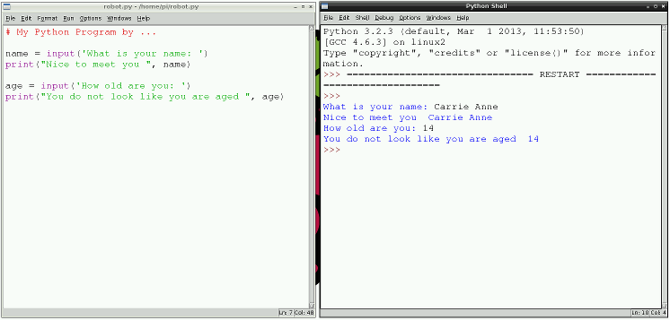
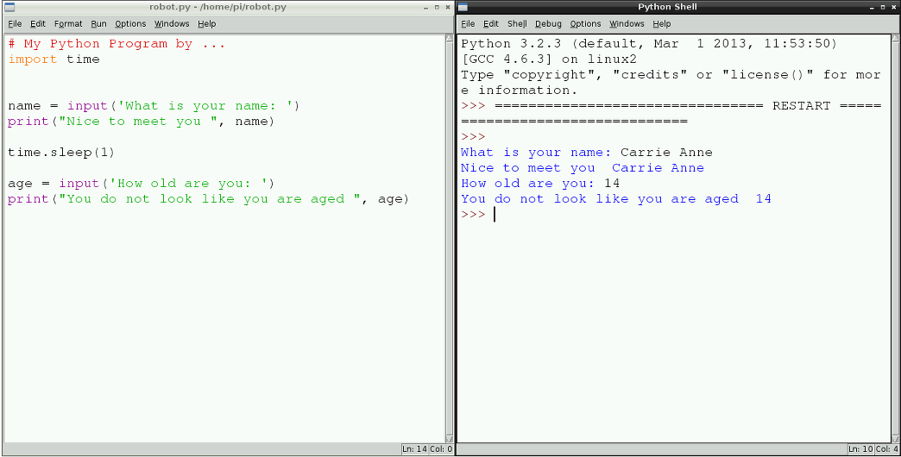

# Lesson 2 - Can Computers Think For Themselves? 

## Introduction

This lesson will give an introduction to Python programming by writing a simple program to take user input, and then print statements to the screen. It builds on lesson 1 using IDLE 3 to program in Python 3.


## Learning objectives

- Know how to debug code
- Understand the differences between speaking to a human and speaking to a computer program
- Be able to create and debug a simple computer program in Python using `print` and user input


## Learning outcomes

###All students are able to:

- Be able to write a simple Python program and check that it works.

### Most students are able to:

- Know that Python is a computer programming language.  
- Be able to write a simple Python program, and explain the sequence it is following.

### Some students are able to:

- Understand the limitations of computers, compared to human intelligence, when following a sequence of instructions. 


## Lesson summary

- The first Python program

## Starter

Direct students to a website containing a chat bot like [Elbot](http://www.elbot.com/), or display a website with a chat bot to the class. You could even use Siri on an Apple device. 

Students may ask questions to the chat bot. Ask them to note any answers that don’t quite match the questions; for example 'who is the best football player in the world?'. After a few minutes have the students feedback in a whole class discussion. The teacher should note some of the questions that may have confused the chat bot. Draw out from students any themes, or reasons why they may think the chat bot could not answer their questions as they would expect.

Ask the students why it is so hard for programs like these to understand and interact with humans. Why is it so easy to confuse them? Draw out from questioning that computers execute or run programs that follow a sequence of instructions, and that they can only follow this sequence. 

Explain the concept of the [Turing test](http://en.wikipedia.org/wiki/Turing_test) and artificial intelligence. Explain that in this lesson, students will write Python programs on the Raspberry Pi to turn them into a chatting robot.


## Main development

1. Ask students to set up their Raspberry Pi equipment, turn it on and log into their Pi using the username `pi` and the password `raspberry`.

	*Note that students will not see any text when typing the password but assure them it is working. Why do they think this might be the case? Hint: what might happen if someone was looking over their shoulder?*
	
2. Next, students should load the graphical environment by typing `startx`. To use Python, students will need to access the programming environment **IDLE3**. To open IDLE3, students can either double-click on the IDLE3 icon on the desktop or click on the **Main Menu** and select **Programming**, followed by **IDLE 3**.

	

3. Demonstrate the IDLE interpreter window to students. Explain that commands can be typed directly into this window after the prompt which looks like this: `>>>`. This window is referred to as the interpreter or shell. You can type a line of code after this prompt and press Enter; this will run that line of code. You can demonstrate this with `print("Hello World!")`. Ask students what they could replace the "Hello World" with. Have them experiment using the interpreter window for a few minutes. Explain that the computer can only follow one instruction at a time in **sequence**. 

4. Explain to students that when you are writing many lines of code in a program, it can become tiresome to use the interpreter; should you want to save your code, it is better to use a text editor. Show students how to create a new text editor file by clicking on **File>New Window** from the menu at the top of the **IDLE3** window. Show students how to save this file, by clicking on **File>Save As** and naming it `name1.py`.

5. Direct students to type the following code into the text editor window. Point out the difference between a comment and a line of code. Comments are parts of a program that are ignored by the computer, so we can make notes about what is happening in the program. 

	```python
	
	# My Python Program by ....
	
	name = input('what is your name: '),
	print("Nice to meet you ", name)
	```
	
	*Note that the spaces before `"` in the string are important.*
	
	Save the file as a Python file by clicking on **File** then **Save As**, and name it **robot**.
	
	Then run the file by clicking on **Run** then **Run Module**.
	
	

6. Students can then add their own input and `print` statements, perhaps asking for the user's age or their favourite colour. For example, they could add:

	```python
	
	age = input('How old are you: ')
	print("You do not look like you are aged ", age)
	```
	Direct students to save the file and run the code as before.
	
	
	
7. Once students have working programs with multiple questions, introduce the idea of spacing out the questions asked with time. In a conversation, there is usually a pause between answering a question and asking the next one. The goal is to create a chatting robot that might be confused for a real person; therefore, we need to place a pause in between the questions. This can be achieved using the `time` module. To add the module, students will need to add `import time` underneath the comment and before the questions. Then between the questions they will need to use `time.sleep(1)`, where the value 1 represents 1 second, like this:

	

8. Allow the students to continue writing code to take user input and post information to the screen. Then ask students to save their work and shut down the Raspberry Pis by clicking on the **Shutdown** button on the desktop.

## Plenary

Ask students to choose three new words they have learnt today or in the last few lessons, and define them. Then ask students to write a paragraph for each of the words, or one using all three at once.


## Homework

Students should think of five questions that they would like their chatting robot to ask, ready for the next lesson.

