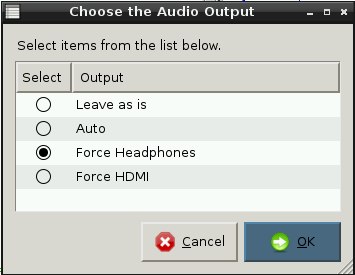

# Lesson 3 - Turning Text Into Sound

##Introduction

This lesson will teach students how to take their chatting robot programs, which currently print the conversation to the screen, and turn them into speaking robots where they can hear their robot ask the question. 

You will need to ensure that 'espeak' has been downloaded and installed on the SD cards using `sudo apt-get install espeak`.

Students will need access to headphones in order to hear the sounds. You may also require a speaker to demonstrate to the class.

Finally, you will need to ensure that sound is being forced to the headphones rather than HDMI by typing `amixer cset numid=3 1`, or by double-clicking on the Python Games icon and selecting **Force Headphones**.

## Learning Objectives

- Identify and use input and output devices on a Raspberry Pi
- Be able to add code to chatting robot programs on the Raspberry Pi to allow text to be read aloud by it
- Test and evaluate the chatting robot programs created so far


## Learning Outcomes

###All students are able to:

- Identify an input and an output device on a Raspberry Pi computer.
- Add some code to a chatting robot program to allow text to be read aloud by it.


###Most students are able to:

- Test and provide feedback to their peers on their chatting robot program.

###Some students are able to:

- Devise ways to improve the chatting robot program through evaluation.


## Lesson Summary

- A parts labelling activity 
- Adding text-to-speech
- Improved Python programs

## Starter

Place at least four sets of the following out on desks unconnected, or however many you can find of each item from the list: 

- Raspberry Pi 
- Speaker
- Headphones 
- Pi camera (if you have one) 
- Webcam
- Keyboard
- Mouse
- Monitor 

Allocate students to groups and give each group a different colour of sticky notes or paper. Give students time to label all the components with the following information:

- What it is
- Whether it is an input, process or output device
- What it does

After students have labelled the components, ask groups to explain their answers. Identify any which are incorrect or really interesting, and discuss the reasoning with the class. Explain that all computers have inputs and outputs. This is important to note for their chatting robot program, as they want to hear its speech outputting to headphones or a speaker.



## Main Development

1. Ask students to set up their Raspberry Pi equipment, turn it on and log into their Pi using the username `pi` and the password `raspberry`. They should then load their chatting robot programs using **IDLE3**.
	
2. Using their homework from the previous lesson, instruct students to add more questions to their code using `input` and `print`.

3. Explain that now students will need to add some code in order for the Raspberry Pi to speak the words in the program. Students will need to add the following code to the top of their programs:

	```python
	# My Python Program by ...
	import os, time
	
	def robot(text):
	    os.system("espeak ' " + text + " ' ")
	
	robot("Hello")
	```
	*Note that the indentation is important; the text editor in IDLE3 should auto-indent for you. Also, the spacing and use of quotation marks is important. The program will not work without them.*    

4. Ask students to save this as a new file by clicking on **File** and **Save As**, then name it **robot1**. They can then run their programs and they should hear a voice say "hello"!

5. Next, explain that instead of printing the questions to the screen, they can now get their robot voice to say them and then reply. 

	To do this they first need to replace the word `print` with the function name `robot`, then remove the comma `,` and replace it with a plus symbol `+`. Ask students to save and test at this point. Can they explain what happens? Bonus points to anyone who can think of a way to get the robot to ask the questions as well! The answer is to add another line above the input line using the `robot` function, for example:
	
	```python
	robot('What is your name')
	name = input('What is your name: ')
	robot("Nice to meet you " + name)
	```

	

## Plenary

Direct students to swap seats with a partner. They have a few minutes to test their partners programs, and suggest at least one improvement by writing a comment using the `#` symbol. Students should then return to their programs and make the suggested improvement.

As an extension task, students could remove one line of code from their partner's program, swap back and see if they can fix the broken code!


